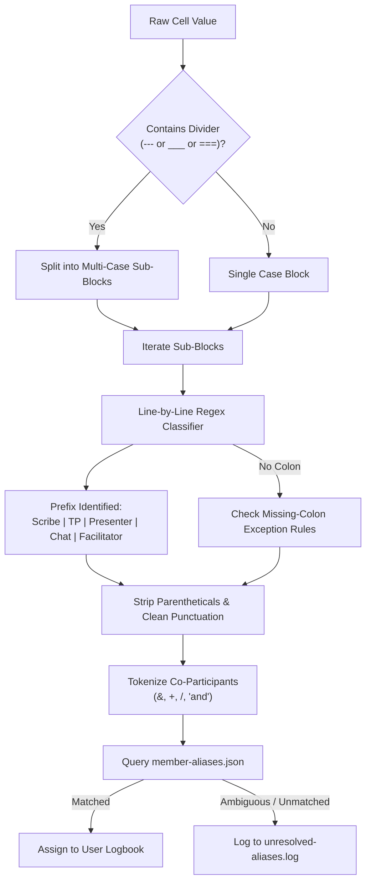

# CPS Academy Personal Activity Logbook: Architectural Specification & Historical Data Audit

**Document Version:** 1.0.0  
**Target View:** `#/profile/logbook`  
**Scope:** Historical Data Audit, Backfill Normalization Engine, Logbook Data Model, and Scheduler Integration Specification  
**Status:** Architectural Specification (No Application Code Modified)

---

## 1. Strict Tone & Copy Charter (Zero AI-Slop & Zero Nudges)

The Personal Activity Logbook is designed to function strictly as a **clinical procedure logbook**—the medical education analog of surgical case logs (e.g., ACGME procedural logs or MedHub). It serves as a verified, immutable ledger for personal reflection, CV tracking, academic promotion dossiers, and credentialing.

### 1.1 Guiding Principles
- **Zero Editorializing:** The interface and system outputs must contain **NO** motivational cheerleading (*"Great job on 5 sessions this month!"*, *"Keep the momentum going!"*), **NO** corporate guilt or gamification (*"You haven't contributed this quarter"*, streaks, badges, points), and **NO** unsolicited recommendations or nudges (*"Consider volunteering for Scribe next week"*).
- **Clinical Procedure Standard:** Present purely objective numbers, ISO dates, discrete clinical roles, and session topics. Quantitative metrics are unweighted ledger counts.
- **Absolute Personal Privacy:** 
  - The view at `#/profile/logbook` must be strictly scoped to the currently authenticated member.
  - No public leaderboards, peer comparisons, cohort averages, percentiles, or administrator ranking views exist within this model.
  - Data exports (JSON/CSV/PDF) are self-service tools for the individual clinician's records.

---

## 2. Workbook Historical Data Audit

An exhaustive audit of the Academy workbook (`CPSolvers Content, Org Chart, Important links .xlsx`) and its structured snapshot (`workbook.json`) was conducted across both historical series: **Morning Report** and **CPS Academy VMRs**, cross-referenced against `OrgStructure` and `Members`.

### 2.1 Dataset Parameters

| Dataset | Total Records | Date Range | Primary Scheduling Topology | Record Density |
| :--- | :--- | :--- | :--- | :--- |
| **Morning Report** | 2,368 | 2020-03-15 to 2026-10-31 | Strict 1-row-per-calendar-day (2,368 unique dates) | High: multiple cases/roles packed in single cells |
| **CPS Academy VMRs** | 255 | 2023-06-14 to 2026-09-01 | 1-row-per-session | Moderate: dedicated columns per session |
| **Members (Directory)** | 154 | N/A | Canonical roster baseline | Canonical profile attributes (Email, Location, Sponsor) |
| **OrgStructure** | 49 | N/A | Working group & leadership rosters | Critical disambiguation context (team memberships) |

---

### 2.2 Morning Report Column & Field Coverage Audit

Out of 2,368 Morning Report records, field population across clinical roles is distributed as follows:

```
Total MR Rows: 2,368
├── Facilitator Column Populated: 2,237 (94.5%)
├── Presenter Column Populated: 46 (1.9%) [CRITICAL AUDIT FINDING]
├── Scribe / Teaching Points Sign-Ups Populated: 2,310 (97.5%)
│   ├── Multi-line Cells: 2,128 (92.1%)
│   ├── Cells with Multi-Case Dividers (--- or ___): 105 (4.5%)
│   └── Total Individual Person-Role Tokens: 5,846
├── Active Participant 1–4 Columns: 19, 17, 4, 2 (Legacy 2020 only)
└── Chat Support Column: 4 (Legacy 2020 only)
```

#### The Presenter Column Discovery
In the raw spreadsheet, the dedicated `Presenter` column was abandoned early in 2020 after only 46 rows. Presenters were subsequently recorded within the multi-line `Scribe / teaching points sign-ups` cell under the prefix `Case Presenter:`. 
- Rows containing `scribe` label: **2,194**
- Rows containing `teaching points` label: **2,168**
- Rows containing `case presenter` label: **1,826**
- Rows containing `discord chat` / `zoom chat`: **304**

Any extraction engine relying solely on the spreadsheet's top-level column headers will miss >97% of historical case presentations.

---

### 2.3 String Pattern & Separator Catalog

When recording members in both `Facilitator` and `Scribe / teaching points sign-ups`, cell entries exhibit rich multi-author delimiters and unstructured notations:

#### Delimiter Taxonomy
1. **Ampersand (`&`):**
   - Standard pair: `Reza & Rabih`, `Maddy & Youssef`, `Sneha & Lera`
   - Spaced multi-line cluster (denoting concurrent morning reports): `TBD \n\n&\n\n Alec & Austin`, `Youssef & Magnus & Alec & Austin`
2. **Forward Slash (`/`):**
   - Co-facilitation / Co-scribing: `Rabih/Reza`, `Steph/Zaven`, `Praveen/Lukas`, `Lukas/Seeme`
   - Disambiguation / alternatives: `Kuchal / Or Ethan`, `Jeffrey / Kirtan`
3. **Plus Sign (`+`):**
   - Whitespace padded: `Dan Restrepo + Reza`, `Shriya + Deb`
   - Unpadded: `Azeb+AMK`, `Amanda+Noah`, `Greg Kirschen+`
4. **Natural Language (`and`, `with`, `w/`):**
   - Co-roles: `Seeme and Noor`, `Leenah and Arianna`
   - Guest pairing: `Rabih w/Ori Leiberman`, `Youssef with Dr. Tony Breu`, `Shivani Sundarum with John Black`
5. **Commas (`,`):**
   - Co-participants: `Kritika, Gerardo (back-up)`, `Sam (Sarah's Friend), Sarah B`
   - *Parsing Trap:* Commas frequently occur inside parenthetical notes describing geography or role (e.g., `Kyaw. Thet (Aye's friend, physician from Burma)`). Commas inside parentheses must **never** be treated as entity delimiters.

#### Parenthetical & Inline Annotations Catalog
The audit identified 221 entries in `Scribe / teaching points sign-ups` containing parenthetical annotations that must be parsed without losing the participant's identity:
- **Operational availability:** `Varsha (can switch)`, `Gillian (can switch)`, `Renzo (can switch)`, `Krishi (can switch)`
- **Experience tracking:** `Adam (2nd time case presenter)`, `Mattia (1st time case presenter)`, `Nicole (1st time case presenter)`, `Rida (first time)`, `Mahnoor (first case)`
- **Contingency / Backup:** `Kris (backup: Ethan)`, `(Maddy with back-up case)`
- **Social / Mentorship provenance:** `Kyaw Thet (Aye's friend from Burma)`, `Alexander (Alex) Winkler (mentored by Siva and Alec)`, `Aakriti (CRC - Ximena and Ramaswamy mentored)`
- **Alternative / Preferred name:** `Brandy (Xiaoyun)`
- **Informal punctuation / Emojis:** `Sneha & Lera :)`, `Sneha & Lera 🙂`

#### Multi-Case Session Dividers
In 105 records, multiple distinct cases occurred on the same morning and were recorded within a single cell separated by ascii rules:
```text
Scribe: Lukas
Teaching Points: Varsha
Case Presenter: Eyron
_____________________________________

Scribe: Noah
Teaching Points: Preethi
Case Presenter: Praveen
```
Or with dashed boundaries:
```text
Scribe: Chris
Teaching Points: Ramaswamy
Case Presenter: Ethan
---------------------------------------------------------------
Scribe: Meghna
Teaching Points: Eyron
Case Presenter: Kyaw Thet
```

---

### 2.4 Name Variation & Collision Catalog

Cross-referencing extracted tokens against `Members` (154 directory records) identified significant variation between spreadsheet tokens and canonical identities.

#### 1. Disambiguation of Identical First Names

| Ambiguous Token | Total Occurrences | Canonical Candidate 1 | Canonical Candidate 2 | Canonical Candidate 3 | Deterministic Disambiguation Rule in Historical Data |
| :--- | :--- | :--- | :--- | :--- | :--- |
| **`Zakariyya`** | 27 | Zakariyya Gardee | Zakariyya Ellemdin | — | Source explicitly uses `Zakariyya G` / `Zakariyya G.` vs `Zakariyya E` / `Zakariyya E.`. Bare `Zakariyya` without initial maps to `Zakariyya Gardee` (VMR leadership) based on date cohort (post-2024). |
| **`Julia`** | 58 | Julia Zanco | Julia Schlender | Julia Rogers / Julia Ding (Guests) | Source frequently writes `Julia Z` / `Julia Z.`. OrgStructure confirms Julia Zanco on VMR team; Julia Schlender is an unassociated directory entry. |
| **`Maddy`** | 45 | Maddy Conte | Maddy Moulton | — | OrgStructure identifies Maddy Conte as "Co-Director of Internal Operations" and "Monday VMR Leader". Workbook entries "Maddy & Youssef" deterministically resolve to Maddy Conte. |
| **`Youssef`** | 28 | Youssef Saklawi | Youssef Aboulwafa | — | OrgStructure lists Youssef Saklawi as Co-Director with Maddy Conte. Co-appearances with Maddy resolve to Youssef Saklawi. |
| **`Alex`** | 17 | Alex Winkler | Alex Smith | Alex Lundberg | Source explicitly uses `Alexander (Alex) Winkler` or `Alex Horne`. |
| **`Daniel`** | 1 | Daniel Lim | Daniel Mathew | — | Requires disambiguation via email cross-reference or audit flag. |

#### 2. High-Frequency Nicknames vs. Canonical Full Names

| Raw Spreadsheet Token | Frequency in Log | Canonical Full Name (`Members` / Leadership) | Canonical Status |
| :--- | :--- | :--- | :--- |
| `Rafa` | 144 | Rafael Medina | Established Leader / CRC |
| `Andrea` | 143 | Andrea Velasquez | Established Member |
| `Sukriti` | 138 | Sukriti Banth | Core VMR Team |
| `Gabi` / `Gabriel` | 110 | Gabriel Talledo | Active Facilitator |
| `Glen` | 56 | Glen Finney | Core Faculty / Attending |
| `Hans` | 41 | Hans Hurtado | Scribe / Teaching Points Team |
| `Travis` | 41 | Travis Halbert | Active Member |
| `Kuchal` | 37 | Kuchal Agrawal | Active Member |
| `Franco` | 32 | Franco Febres | Core Team |
| `Bea` | 31 | Beatriz Mestre | Core Team |
| `Vini` | 28 | Vinicius Serra | Case Review Committee Leadership |
| `Madellena` | 69 | Maddalena Sirgiovanni | Scribe Team (Common Misspelling) |

#### 3. Struck-Through / Cancelled Entries
Spreadsheet shared strings contain 12 strike-through strings representing cancelled commitments (e.g., `STRIKE: Scribe: Andrea | Teaching Points: Amanda | Case Presenter:` with `Cancelled`). These must be caught so non-events are **not** credited to clinical logbooks.

---

## 3. Historical Alias Resolution Engine

To convert 6,000+ raw historical string instances into verified personal logbook entries, the extraction engine operates deterministically via a curated configuration file: `member-aliases.json`.

### 3.1 `member-aliases.json` Schema Specification

```json
{
  "$schema": "http://json-schema.org/draft-07/schema#",
  "title": "MemberAliasRegistry",
  "description": "Deterministic mapping from raw historical spreadsheet strings to canonical user accounts",
  "type": "object",
  "properties": {
    "version": { "type": "string", "example": "1.0.0" },
    "last_updated": { "type": "string", "format": "date" },
    "members": {
      "type": "array",
      "items": {
        "$ref": "#/definitions/CanonicalMember"
      }
    },
    "guest_accounts": {
      "type": "array",
      "items": {
        "$ref": "#/definitions/GuestEntity"
      }
    }
  },
  "required": ["version", "members"],
  "definitions": {
    "CanonicalMember": {
      "type": "object",
      "properties": {
        "user_id": { "type": "string", "description": "Canonical user UUID or scheduler ID" },
        "canonical_name": { "type": "string" },
        "email": { "type": "string", "format": "email" },
        "source_member_id": { "type": "string", "example": "Members:57" },
        "aliases": {
          "type": "array",
          "items": { "type": "string" },
          "description": "Normalized, case-insensitive string tokens that resolve to this member without ambiguity"
        },
        "contextual_rules": {
          "type": "array",
          "items": {
            "type": "object",
            "properties": {
              "raw_pattern": { "type": "string", "description": "Regex or string matching ambiguous token" },
              "date_after": { "type": "string", "format": "date" },
              "date_before": { "type": "string", "format": "date" },
              "co_participants_include": { "type": "array", "items": { "type": "string" } },
              "role_constraint": { "type": "string", "enum": ["Facilitator", "Presenter", "Scribe", "Teaching Points", "Chat Support"] },
              "resolution_notes": { "type": "string" }
            },
            "required": ["raw_pattern"]
          }
        }
      },
      "required": ["user_id", "canonical_name", "email", "aliases"]
    },
    "GuestEntity": {
      "type": "object",
      "properties": {
        "guest_id": { "type": "string" },
        "display_name": { "type": "string" },
        "affiliation": { "type": "string" },
        "aliases": { "type": "array", "items": { "type": "string" } }
      },
      "required": ["guest_id", "display_name", "aliases"]
    }
  }
}
```

---

### 3.2 Concrete Regex Role Extraction Rules

To extract discrete roles from multi-line cells, parsing proceeds through four deterministic stages:



#### Stage 1: Case Block Partitioning
Split cell text across major section boundaries:
```regex
/(?:\r?\n)*(?:[-_—=]{3,}|(?=Case\s+\d+:))(?:\r?\n)*/i
```

#### Stage 2: Line Role Classification
Identify the clinical role from the line prefix (tolerant of common typos and whitespace):
```regex
^(?<role>Scribe|Teaching\s*Points?|Teching\s*Points?|TP|Case\s*Presenter(?:\s*#?\d+)?|Presenter(?:\s*#?\d+)?|Discord\s*Chat|Chat\s*Moderator\s*(?:within\s*Zoom)?|Facilitator(?:\s*#?\d+)?)\s*[:\-–]\s*(?<content>.*)$/i
```

#### Stage 3: Missing-Colon Fallback Classification
Detect historical entries where colons were omitted:
```regex
^(?<role>Case\s*Presenter|Scribe)\s+(?<content>[A-Z][a-z]+(?:\s+[A-Z][a-z]+)*)$/
```
*(Handles `Case Presenter  Hee Mun`, `Scribe Julia`, `Case Presenter Vinicius Serra`)*

#### Stage 4: Delimiter Tokenization & Parenthetical Protection
1. **Extract Annotations:**
   ```regex
   /\((?<annotation>[^)]+)\)/g
   ```
   Extract metadata (e.g., `(can switch)`, `(1st time case presenter)`), record it in the session metadata, then strip it from the entity token.

2. **Split Co-Participants:**
   Split remainder on delimiters:
   ```regex
   /\s*(?:&|\+|\/|\band\b)\s*/i
   ```

3. **Sanitize Residual Tokens:**
   Trim trailing colons, dashes, periods, and emojis:
   ```regex
   /^[^\w\s]+|[^\w\s\.\'\-]+$/gu
   ```

---

### 3.3 One-Time Backfill Compilation Pipeline

The one-time backfill compilation script (`scripts/compile-historical-logbooks.cjs` or Python equivalent) executes the following strict pipeline:

1. **Ingest Raw Sources:**
   - Load `workbook.json` and read sheet records for `Morning Report` (2,368 rows) and `CPS Academy VMRs` (255 rows).
   - Load `member-aliases.json`.
2. **Filter Non-Events:**
   - Skip rows where status is explicitly `Cancelled`, struck through, or where cell value matches `/^cancelled/i`.
   - Skip placeholder values (`TBD`, `None`, `-`, `NA`, `Open`, `Need Scribe`).
3. **Parse & Tokenize:**
   - Run the 4-stage regex extraction pipeline across every Facilitator, Presenter, and Scribe/TP cell.
4. **Deterministic Alias Resolution:**
   - Check exact alias matches against `member-aliases.json`.
   - If ambiguous (e.g., bare `Julia`), evaluate `contextual_rules` (e.g., matching session date against leadership tenure or pairing with `Youssef`).
   - If match cannot be determined with 100% certainty, emit the unparsed token, row ID, date, and field to `unresolved-aliases.log`. **Never silently drop or guess.**
5. **Compile & Deduplicate:**
   - Deduplicate sessions by composite key `(user_id, date, series, role)`.
   - Compute lifetime role counters and monthly distributions.
   - Sort session ledger in reverse-chronological order (`date` descending).
6. **Output Generation:**
   - Emit consolidated `dist/historical-logbooks.json` keyed by `user_id`.

---

## 4. Personal Activity Logbook Data Model

Each member's personal activity record is structured as an immutable, typed ledger conforming to the JSON schema below.

### 4.1 Schema Definition: `activity-logbook.json`

```json
{
  "$schema": "http://json-schema.org/draft-07/schema#",
  "title": "PersonalActivityLogbook",
  "description": "Clinical procedure logbook for a single authenticated CPS Academy member",
  "type": "object",
  "properties": {
    "schema_version": { "type": "string", "enum": ["1.0.0"] },
    "user_id": { "type": "string", "description": "Canonical UUID matching Scheduler auth account" },
    "canonical_name": { "type": "string" },
    "email": { "type": "string", "format": "email" },
    "generated_at": { "type": "string", "format": "date-time" },
    "source_hash": { "type": "string", "description": "SHA-256 hash of the source workbook snapshot" },
    "privacy_declaration": {
      "type": "string",
      "enum": ["STRICTLY_CONFIDENTIAL_PERSONAL_VIEW_ONLY"]
    },
    "lifetime_metrics": {
      "type": "object",
      "properties": {
        "facilitator_count": { "type": "integer", "minimum": 0 },
        "presenter_count": { "type": "integer", "minimum": 0 },
        "scribe_count": { "type": "integer", "minimum": 0 },
        "teaching_points_count": { "type": "integer", "minimum": 0 },
        "chat_support_count": { "type": "integer", "minimum": 0 },
        "discussant_count": { "type": "integer", "minimum": 0 },
        "total_sessions": { "type": "integer", "minimum": 0 }
      },
      "required": [
        "facilitator_count",
        "presenter_count",
        "scribe_count",
        "teaching_points_count",
        "chat_support_count",
        "discussant_count",
        "total_sessions"
      ]
    },
    "monthly_distribution": {
      "type": "object",
      "description": "Keyed by ISO year-month (YYYY-MM) for CV chronological distribution",
      "patternProperties": {
        "^\\d{4}-(?:0[1-9]|1[0-2])$": {
          "type": "object",
          "properties": {
            "facilitator": { "type": "integer", "default": 0 },
            "presenter": { "type": "integer", "default": 0 },
            "scribe": { "type": "integer", "default": 0 },
            "teaching_points": { "type": "integer", "default": 0 },
            "chat_support": { "type": "integer", "default": 0 },
            "discussant": { "type": "integer", "default": 0 },
            "month_total": { "type": "integer", "default": 0 }
          },
          "required": ["month_total"]
        }
      },
      "additionalProperties": false
    },
    "session_ledger": {
      "type": "array",
      "description": "Reverse-chronological list of verified procedural engagements",
      "items": {
        "$ref": "#/definitions/LedgerEntry"
      }
    }
  },
  "required": [
    "schema_version",
    "user_id",
    "canonical_name",
    "email",
    "generated_at",
    "privacy_declaration",
    "lifetime_metrics",
    "monthly_distribution",
    "session_ledger"
  ],
  "definitions": {
    "LedgerEntry": {
      "type": "object",
      "properties": {
        "session_id": { "type": "string", "description": "Unique deterministic hash: hash(series, date, role, row_id)" },
        "date": { "type": "string", "format": "date", "description": "ISO 8601 date (YYYY-MM-DD)" },
        "series": {
          "type": "string",
          "enum": ["Morning Report", "CPS Academy VMR"]
        },
        "role": {
          "type": "string",
          "enum": [
            "Facilitator",
            "Presenter",
            "Scribe",
            "Teaching Points",
            "Chat Support",
            "Active Discussant"
          ]
        },
        "session_title": { "type": "string", "description": "Session title, clinical topic, or syndrome" },
        "co_participants": {
          "type": "array",
          "items": {
            "type": "object",
            "properties": {
              "name": { "type": "string" },
              "role": { "type": "string" },
              "user_id": { "type": "string", "description": "If resolved to a known member" }
            },
            "required": ["name", "role"]
          }
        },
        "recording_url": { "type": "string", "format": "uri" },
        "annotations": {
          "type": "array",
          "items": { "type": "string" },
          "description": "Preserved raw annotations (e.g., '1st time case presenter')"
        },
        "source_ref": {
          "type": "string",
          "example": "Morning Report:1842",
          "description": "Immutable pointer to source workbook sheet and row number"
        }
      },
      "required": ["session_id", "date", "series", "role", "source_ref"]
    }
  }
}
```

---

## 5. Technical Integration Briefing for Saketh

The following briefing provides the technical specifications, data contracts, and integration blockers required to bridge Saketh's Scheduler service with the CPS Academy Portal logbook architecture.

***

```markdown
To: Saketh Vinjamuri (Technical Lead, CPS Academy Scheduler)
From: Technical Lead / Data Architect, CPS Academy Internal Portal
Subject: Technical Integration Specs & Backfill Data Contract: Personal Activity Logbook
Date: September 7, 2026

Hey Saketh,

As we aligned on previously, we are standing up the private "Personal Activity Logbook" (`#/profile/logbook`) inside the Academy Portal. The clinical logbook is strictly an objective, procedural ledger for personal reflection, CV generation, and credentialing (zero editorializing, zero gamification, zero public leaderboards).

We have completed the historical audit of the workbook (2,368 Morning Report dates and 255 Academy VMRs spanning March 2020 through late 2026) and designed the deterministic alias resolution engine. To link the historical logbook to your authenticated user sessions, we have three technical blockers and specifications we need from you:

### 1. User Account Object Schema
What is the exact shape of your authenticated user object in the Scheduler app? 
We specifically need to know:
- Primary Key: Do you use a UUID (v4), an autoincrement integer, or an external Auth0/Supabase/Clerk ID?
- Identity Keys: Can we rely on `email` (normalized lowercase) as the canonical bridge key between the workbook directory (154 members) and your user table?
- Names: Do you store `full_name`, or separate `first_name` and `last_name`?

*Expected Contract:*
```typescript
interface SchedulerUser {
  id: string;              // e.g. "usr_94a2b1..." or UUID
  email: string;           // Canonical anchor
  name: string;            // e.g. "Saketh Vinjamuri"
  role?: string;           // "member" | "admin" | "lead"
}
```

### 2. Session Propagation & Auth Verification
How does the client verify authentication when navigating from the Scheduler to the Portal?
- If the Portal and Scheduler share a root domain: Can the Portal read an `httpOnly` session cookie via a `/api/auth/me` proxy, or do you issue a signed JWT stored in `localStorage`?
- If cross-origin: Can the Scheduler pass a short-lived bearer token via a secure URL handshake (e.g. `#/auth/callback?token=...`), or will you expose an endpoint like `GET /api/v1/auth/session` with CORS allowed for the Portal origin?

### 3. Historical Backfill Storage Architecture: Option A vs. Option B
We will generate a compiled, deduplicated backfill dataset representing ~6,000 historical role events mapped to canonical user IDs. Where should this historical data live long-term?

- **Option A: Integrated Database (Recommended if Scheduler is system of record)**
  You ingest the backfill JSON into a `session_ledger` table in your database (PostgreSQL / Prisma). 
  - *Pros:* Seamless query combining past historical sessions (2020–2026) with newly scheduled upcoming sessions; unified API (`GET /api/v1/users/me/logbook`).
  - *Schema needed from us:* SQL seed script / normalized JSON matching your relational schema.

- **Option B: Portal Static/Bridge Ledger**
  We store `historical-logbooks.json` statically or via a lightweight micro-endpoint on the Portal side, keyed by your `user.id` or `user.email`. When a user logs into the Portal via your session token, the Portal queries `GET /data/logbooks/{user_id}.json` directly.
  - *Pros:* Zero database migrations for you right now; historical records remain immutable snapshots.
  - *Cons:* Dual-source queries once live sessions from your Scheduler need to merge into the same UI ledger.

### 4. Proposed Minimal Bridge API Contract
If you prefer Option A or wish to expose the merged endpoint from your backend:
```http
GET /api/v1/members/me/logbook
Authorization: Bearer <jwt_token>
```
Response: Conforms 100% to our `PersonalActivityLogbook` JSON schema defined in Section 4.1 of the architecture spec (lifetime counts, monthly buckets, and reverse-chronological session array).

Let us know your preference between Option A and Option B, and share the user object interface so we can finalize the `member-aliases.json` seed dictionary.
```
